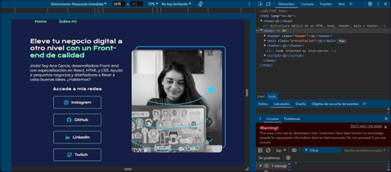
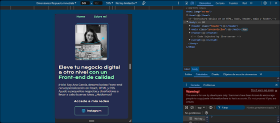

# Proyecto, creación del ortafolio de Ana García

## Descripción

Este es el portafolio personal de Ana García, desarrollado como parte de un proyecto en el programa ONE de Oracle. El diseño del portafolio se basa en un prototipo creado en Figma, lo que garantiza una interfaz visualmente atractiva y bien estructurada. El proyecto está diseñado para ser responsivo y se adapta tanto a ordenadores como a dispositivos móviles. El fondo del cuerpo de la página cambia de color en función del punto de quiebre (breakpoint), brindando una experiencia visual adaptada a diferentes tamaños de pantalla.

## Características

- **Diseño Responsivo**: El portafolio se adapta a diferentes tamaños de pantalla, desde ordenadores de escritorio hasta dispositivos móviles.
- **Cambio de Color de Fondo**: El color de fondo del `body` cambia según el dispositivo.
- **Sección "Home"**: La página principal del portafolio, que ofrece una visión general de Ana García.
- **Sección "Sobre Mí"**: Contiene un espacio reservado (`placeholder`) y una imagen de Ana.
- **Enlaces a Redes Sociales**: Proporciona enlaces a las diferentes redes sociales (estos solo redireccionan a las páginas oficiales de las página, no al perfil de la persona).
  
## Tecnologías Utilizadas

- HTML
- CSS
- Flexbox

## Capturas de Pantalla

## Hecho por:
Gabriela Cecilia Ángeles Gómez.
- [GitHub Repository](https://github.com//portafoliCecilia/portafolio-proyecto-)
- [LinkedIn](www.linkedin.com/in/gabriela-cecilia-ángeles-gómez-0b1345315)
- [Instagram](https://instagram.com/gaby_ang1)

Gracias por visitar mi proyecto sobre el portafolio de Ana García. ¡Espero que disfrutes explorándolo!

